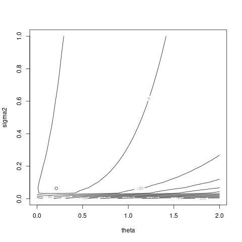

# `NoiseKriging::logLikelihoodFun`


## Description

Compute Log-Likelihood of NoiseKriging Model for given $\theta,\over{\sigma^2}{\sigma^2+nugget}$


## Usage

* Python
    ```python
    # k = NoiseKriging(...)
    k.logLikelihoodFun(theta_sigma2)
    ```
* R
    ```r
    # k = NoiseKriging(...)
    k$logLikelihoodFun(theta_sigma2)
    ```
* Matlab/Octave
    ```octave
    % k = NoiseKriging(...)
    k.logLikelihoodFun(theta_sigma2)
    ```


## Arguments

Argument      |Description
------------- |----------------
`theta_sigma2`     |     A numeric vector of (positive) range parameters and variance at which the log-likelihood will be evaluated.
`grad`     |     Logical. Should the function return the gradient?


## Value

The log-Likelihood computed for given
  $\theta,\sigma^2$ .


## Examples

```r
f <- function(x) 1 - 1 / 2 * (sin(12 * x) / (1 + x) + 2 * cos(7 * x) * x^5 + 0.7)
set.seed(123)
X <- as.matrix(runif(5))
y <- f(X) + 0.1*rnorm(nrow(X))
r <- NoiseKriging(y, rep(0.1^2,5), X, kernel = "gauss")
print(r)
sigma2 = as.list(r)$sigma2
ll <- function(theta) logLikelihoodFun(r, cbind(theta,sigma2))$logLikelihood
t <- seq(from = 0.001, to = 2, length.out = 101)
plot(t, ll(t), type = 'l')
abline(v = as.list(r)$theta, col = "blue")
```

### Results
```{literalinclude} ../examples/logLikelihoodFun.NoiseKriging.md.Rout
:language: bash
```

