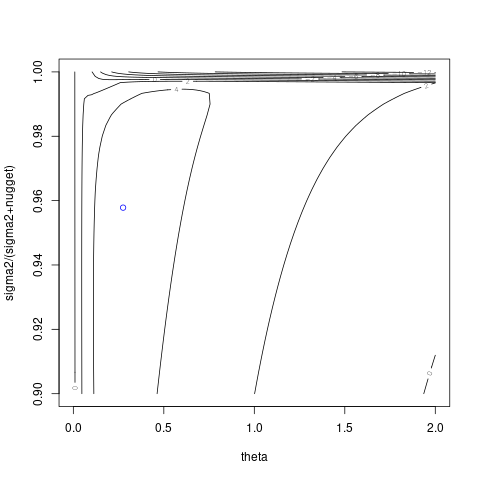

# `NuggetKriging::logLikelihoodFun`


## Description

Compute Log-Likelihood of NuggetKriging Model for given $\theta,\frac{\sigma^2}{\sigma^2+nugget}$


## Usage

* Python
    ```python
    # k = NuggetKriging(...)
    k.logLikelihoodFun(theta_alpha, grad = FALSE)
    ```
* R
    ```r
    # k = NuggetKriging(...)
    k$logLikelihoodFun(theta_alpha, grad = FALSE)
    ```
* Matlab/Octave
    ```octave
    % k = NuggetKriging(...)
    k.logLikelihoodFun(theta_alpha, grad = FALSE)
    ```


## Arguments

Argument      |Description
------------- |----------------
`theta_alpha`     |     A numeric vector of (positive) range parameters and variance over nugget + variance at which the log-likelihood will be evaluated.
`grad`     |     Logical. Should the function return the gradient?


## Value

The log-Likelihood computed for given
  $\theta,\frac{\sigma^2}{\sigma^2+nugget}$ .


## Examples

```r
f <- function(x) 1 - 1 / 2 * (sin(12 * x) / (1 + x) + 2 * cos(7 * x) * x^5 + 0.7)
set.seed(123)
X <- as.matrix(runif(10))
y <- f(X) + 0.1 * rnorm(nrow(X))

k <- NuggetKriging(y, X, kernel = "matern3_2")
print(k)

# alpha = k$sigma2()/(k$sigma2()+k$nugget())
# ll <- function(theta) k$logLikelihoodFun(cbind(theta,alpha))$logLikelihood
# from = 0.001, to = 2, length.out = 101)
# plot(t, ll(t), type = 'l')
# abline(v = k$theta(), col = "blue")

ll <- function(theta_alpha) k$logLikelihoodFun(theta_alpha)$logLikelihood
t <- seq(from = 0.001, to = 1, length.out = 31)
contour(t,t,matrix(ncol=length(t),ll(expand.grid(t,0.5*t))),xlab="theta",ylab="sigma2/(sigma2+nugget)")
points(k$theta(),k$sigma2()/(k$sigma2()+k$nugget()),col='blue')
```

### Results
```{literalinclude} ../examples/logLikelihoodFun.NuggetKriging.md.Rout
:language: bash
```

