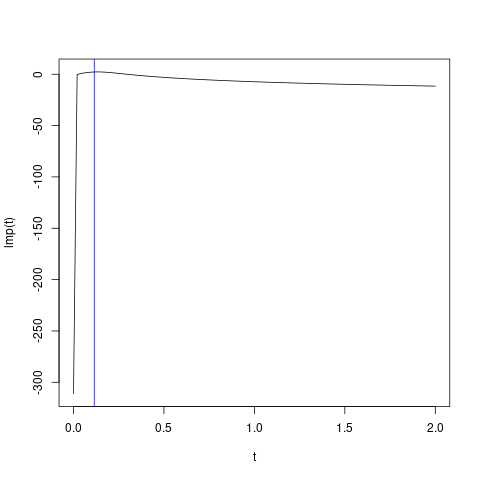

# `Kriging::logMargPostFun`

## Description

Compute the log-marginal posterior of a kriging model, using the
 prior XXXY.


## Usage

* Python
    ```python
    # k = Kriging(...)
    k.logMargPostFun(theta, grad = FALSE)
    ```
* R
    ```r
    # k = Kriging(...)
    k$logMargPostFun(theta, grad = FALSE)
    ```
* Matlab/Octave
    ```octave
    % k = Kriging(...)
    k.logMargPostFun(theta, grad = FALSE)
    ```


## Arguments

Argument      |Description
------------- |----------------
`theta`     |     Numeric vector of correlation range parameters at which the function is to be evaluated.
`grad`     |     Logical. Should the function return the gradient (w.r.t theta)?


## Value

The value of the log-marginal posterior computed for the
 given vector $\theta$.


## Examples

```r
f <- function(x) 1 - 1 / 2 * (sin(12 * x) / (1 + x) + 2 * cos(7 * x) * x^5 + 0.7)
set.seed(123)
X <- as.matrix(runif(10))
y <- f(X)

k <- Kriging(y, X, "matern3_2", objective="LMP")
print(k)

lmp <- function(theta) k$logMargPostFun(theta)$logMargPost

t <- seq(from = 0.01, to = 2, length.out = 101)
plot(t, lmp(t), type = "l")
abline(v = k$theta(), col = "blue")
```

### Results
```{literalinclude} ../examples/logMargPostFun.Kriging.md.Rout
:language: bash
```



