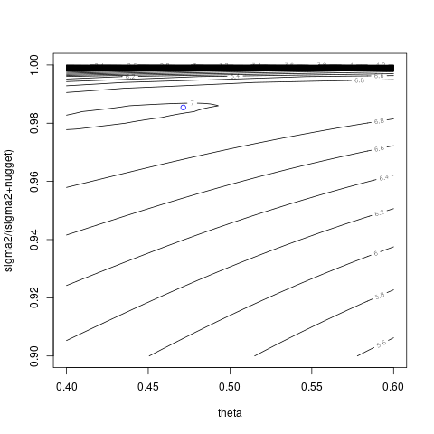

# `NuggetKriging::logMargPostFun`

## Description

Compute the log-marginal posterior of a kriging model, using the prior XXXY for given $\theta,\frac{\sigma^2}{\sigma^2+nugget}$


## Usage

* Python
    ```python
    # k = Kriging(...)
    k.logMargPostFun(theta_alpha, grad = FALSE)
    ```
* R
    ```r
    # k = Kriging(...)
    k$logMargPostFun(theta_alpha, grad = FALSE)
    ```
* Matlab/Octave
    ```octave
    % k = Kriging(...)
    k.logMargPostFun(theta_alpha, grad = FALSE)
    ```


## Arguments

Argument      |Description
------------- |----------------
`theta_alpha`     |     Numeric vector of correlation range and variance over nugget+ variance parameters at which the function is to be evaluated.
`grad`     |     Logical. Should the function return the gradient (w.r.t theta_alpha)?


## Value

The value of the log-marginal posterior computed for the
 given vector $\theta,\frac{\sigma^2}{\sigma^2+nugget}$.


## Examples

```r
f <- function(x) 1 - 1 / 2 * (sin(12 * x) / (1 + x) + 2 * cos(7 * x) * x^5 + 0.7)
set.seed(123)
X <- as.matrix(runif(10))
y <- f(X) + 0.1 * rnorm(nrow(X))

k <- NuggetKriging(y, X, "matern3_2", objective="LMP")
print(k)

# alpha = k$sigma2()/(k$nugget()+k$sigma2())
# lmp <- function(theta) k$logMargPostFun(cbind(theta,alpha))$logMargPost
# t <- seq(from = 0.01, to = 2, length.out = 101)
# plot(t, lmp(t), type = "l")
# abline(v = k$theta(), col = "blue")

lmp <- function(theta_alpha) k$logMargPostFun(theta_alpha)$logMargPost
t <- seq(from = 0.001, to = 1, length.out = 31)
contour(2*t,t,matrix(ncol=length(t),lmp(expand.grid(2*t,t))))
points(k$theta(),k$sigma2()/(k$sigma2()+k$nugget()),col='blue')
```

### Results
```{literalinclude} ../examples/logMargPostFun.NuggetKriging.md.Rout
:language: bash
```



