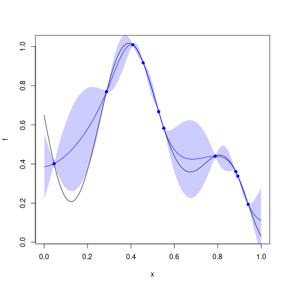

# `Kriging::predict`


## Description

Predict from a `Kriging` Model Object


## Usage

* Python
    ```python
    # k = Kriging(...)
    k.predict(x, stdev = True, cov = False, deriv = False)
    ```
* R
    ```r
    # k = Kriging(...)
    k$predict(x, stdev = TRUE, cov = FALSE, deriv = FALSE)
    ```
* Matlab/Octave
    ```octave
    % k = Kriging(...)
    k.predict(x, stdev = true, cov = false, deriv = false)
    ```

## Arguments

Argument      |Description
------------- |----------------
`x`     |     Input points where the prediction must be computed.
`stdev`     |     `Logical` . If `TRUE` the standard deviation is returned.
`cov`     |     `Logical` . If `TRUE` the covariance matrix of the predictions is returned.
`deriv`     |     `Logical` . If `TRUE` the derivatives of mean and sd of the predictions are returned.


## Details

Given $n^\star$ "new" input points $\mathbf{x}^\star_{j}$, the method
compute the expectation, the standard deviation and (optionally) the covariance
of the "new" observations $y(\mathbf{x}^\star_j)$ of the
stochastic process, conditional on the $n$ values $y(\mathbf{x}_i)$ at
the input points $\mathbf{x}_i$ as used when fitting the model. The
$n^\star$ input vectors (with length $d$) are given as the rows of a
$\mathbf{X}^\star$ corresponding to `x`.

The computation of these quantities is often called *Universal
Kriging* see [here](SecPredAndSim) for more details.


## Value

A list containing the element `mean` and possibly `stdev` and
`cov`. 

- The expectation in ` mean` is the estimate of the vector
   $\textsf{E}[\mathbf{y}^\star \, \vert \,\mathbf{y}]$ with length
   $n^\star$ where $\mathbf{y}^\star$ and $\mathbf{y}$ are the random
   vectors corresponding to the observation and the "new" input
   points. Similarly the conditional standard deviation in `stdev` is
   a vector with length $n^\star$ and the conditional covariance in
   `cov` is a $n^\star \times n^\star$ matrix. 
   
- The (optional) derivatives are two $n^\star \times d$ matrices
   `pred_mean_deriv` and ` pred_sdtdev_deriv` with their row $j$
   containing the vector of derivatives w.r.t. to the new input point
   $\mathbf{x}^\star$ evaluated at $\mathbf{x}^\star =
   \mathbf{x}^\star_j$. So the row $j$ of `pred_mean_deriv` contains
   the derivative $\partial_{\mathbf{x}^\star}
   \mathbb{E}[y(\mathbf{x}^\star) \, \vert \,\mathbf{y}]$.  evaluated
   at $\mathbf{x}^\star = \mathbf{x}^\star_j$.

Note that for a `Kriging` object the prediction is actually an
interpolation.


## Examples

```r
f <- function(x) 1 - 1 / 2 * (sin(12 * x) / (1 + x) + 2 * cos(7 * x) * x^5 + 0.7)
plot(f)
set.seed(123)
X <- as.matrix(runif(10))
y <- f(X)
points(X, y, col = "blue", pch = 16)

k <- Kriging(y, X, "matern3_2")

x <-seq(from = 0, to = 1, length.out = 101)
p <- k$predict(x)

lines(x, p$mean, col = "blue")
polygon(c(x, rev(x)), c(p$mean - 2 * p$stdev, rev(p$mean + 2 * p$stdev)), border = NA, col = rgb(0, 0, 1, 0.2))
```

### Results
```{literalinclude} ../functions/examples/predict.Kriging.md.Rout
:language: bash
```



## Reference

* Code: <https://github.com/libKriging/libKriging/blob/master/src/lib/Kriging.cpp#L1326>

