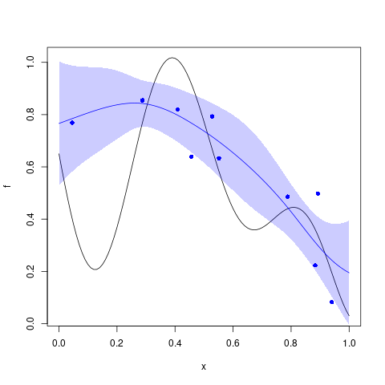

# `NoiseKriging::predict`


## Description

Predict from a `NoiseKriging` object.


## Usage

* Python
    ```python
    # k = NoiseKriging(...)
    k.predict(x, stdev = True, cov = False, deriv = False)
    ```
* R
    ```r
    # k = NoiseKriging(...)
    k$predict(x, stdev = TRUE, cov = FALSE, deriv = FALSE)
    ```
* Matlab/Octave
    ```octave
    % k = NoiseKriging(...)
    k.predict(x, stdev = true, cov = false, deriv = false)
    ```

## Arguments

Argument      |Description
------------- |----------------
`x`     |     Input points where the prediction must be computed.
`stdev`     |     `Logical` . If `TRUE` the standard deviation is returned.
`cov`     |     `Logical` . If `TRUE` the covariance matrix of the predictions is returned.
`deriv`     |     `Logical` . If `TRUE` the derivatives of mean and sd of the predictions are returned.


## Details

Given "new" input points, the method compute the expectation,
 variance and (optionnally) the covariance of the corresponding
 stochastic process, conditional on the values at the input points
 used when fitting the model.


## Value

A list containing the element `mean` and possibly
  `stdev` and `cov` .


## Examples

```r
f <- function(x) 1 - 1 / 2 * (sin(12 * x) / (1 + x) + 2 * cos(7 * x) * x^5 + 0.7)
plot(f)
set.seed(123)
X <- as.matrix(runif(10))
y <- f(X) + 1:10/20 * rnorm(nrow(X))
points(X, y, col = "blue", pch = 16)

k <- NoiseKriging(y, 1:10/20^2, X, "matern3_2")

x <-seq(from = 0, to = 1, length.out = 101)
p <- k$predict(x)

lines(x, p$mean, col = "blue")
polygon(c(x, rev(x)), c(p$mean - 2 * p$stdev, rev(p$mean + 2 * p$stdev)),
border = NA, col = rgb(0, 0, 1, 0.2))
```

### Results
```{literalinclude} ../examples/predict.NoiseKriging.md.Rout
:language: bash
```



## Reference

* Code: <https://github.com/libKriging/libKriging/blob/master/src/lib/NoiseKriging.cpp#L1326>
