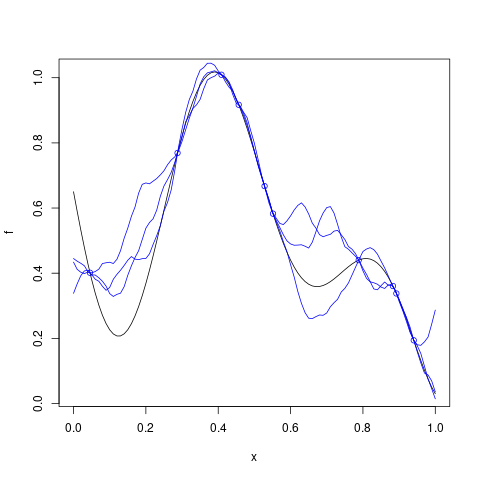

# `Kriging::simulate`


## Description

Simulations from a `Kriging` model object.


## Usage

* Python
    ```python
    # k = Kriging(...)
    k.predict(nsim = 1, seed = 123, x)
    ```
* R
    ```r
    # k = Kriging(...)
    k$predict(nsim = 1, seed = 123, x)
    ```
* Matlab/Octave
    ```octave
    % k = Kriging(...)
    k.predict(nsim = 1, seed = 123, x)
    ```


## Arguments

Argument      |Description
------------- |----------------
`nsim`     |     Number of simulations to perform.
`seed`     |     Random seed used.
`x`     |     Points in model input space where to simulate.


## Details

This method draws paths of the stochastic process at new input
 points conditional on the values at the input points used in the
 fit.


## Value

a matrix with `length(x)` rows and `nsim` 
 columns containing the simulated paths at the inputs points
 given in `x` .


## Examples

```r
f <- function(x) 1 - 1 / 2 * (sin(12 * x) / (1 + x) + 2 * cos(7 * x) * x^5 + 0.7)
plot(f)
set.seed(123)
X <- as.matrix(runif(5))
y <- f(X)
points(X, y, col = "blue")
r <- Kriging(y, X, kernel = "gauss")
x <- seq(from = 0, to = 1, length.out = 101)
s_x <- simulate(r, nsim = 3, x = x)
lines(x, s_x[ , 1], col = "blue")
lines(x, s_x[ , 2], col = "blue")
lines(x, s_x[ , 3], col = "blue")
```

### Results
```{literalinclude} ../examples/simulate.Kriging.md.Rout
:language: bash
```



## Reference

* Code: <https://github.com/libKriging/libKriging/blob/master/src/lib/Kriging.cpp#L1501>


