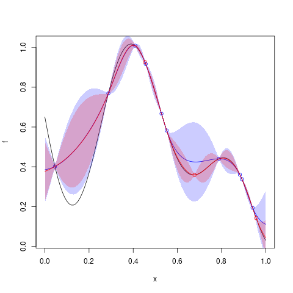

# `Kriging::update`


## Description

Update a `Kriging` model object with new points


## Usage

* Python
    ```python
    # k = Kriging(...)
    k.update(newy, newX)
    ```
* R
    ```r
    # k = Kriging(...)
    k$update(newy, newX)
    ```
* Matlab/Octave
    ```octave
    % k = Kriging(...)
    k.update(newy, newX)
    ```


## Arguments

Argument      |Description
------------- |----------------
`newy`     |     Numeric vector of new responses (output).
`newX`     |     Numeric matrix of new input points.


## Examples

```r
f <- function(x) 1- 1 / 2 * (sin(12 * x) / (1 + x) + 2 * cos(7 * x)*x^5 + 0.7)
plot(f)
set.seed(123)
X <- as.matrix(runif(5))
y <- f(X)
points(X, y, col = "blue")
KrigObj <- Kriging(y, X, "gauss")
x <- seq(from = 0, to = 1, length.out = 101)
p_x <- predict(KrigObj, x)
lines(x, p_x$mean, col = "blue")
lines(x, p_x$mean - 2 * p_x$stdev, col = "blue")
lines(x, p_x$mean + 2 * p_x$stdev, col = "blue")
newX <- as.matrix(runif(3))
newy <- f(newX)
points(newX, newy, col = "red")

## change the content of the object 'KrigObj'
update(KrigObj, newy, newX)
x <- seq(from = 0, to = 1, length.out = 101)
p2_x <- predict(KrigObj, x)
lines(x, p2_x$mean, col = "red")
lines(x, p2_x$mean - 2 * p2_x$stdev, col = "red")
lines(x, p2_x$mean + 2 * p2_x$stdev, col = "red")
```

### Results
```{literalinclude} ../examples/update.Kriging.md.Rout
:language: bash
```

