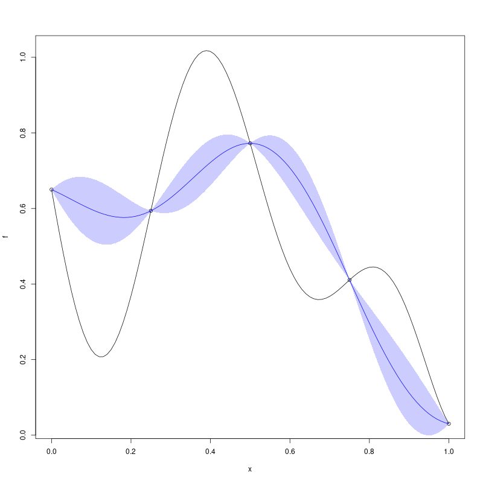

Python/R/Matlab/Octave sample, predict, simulate 1D function
=============

Any sample code below should give you these figures:




* Python: [](https://colab.research.google.com/github/libKriging/readthedocs/blob/master/examples/py-demo.ipynb)
```python
import numpy as np
X = [0.0, 0.25, 0.5, 0.75, 1.0]
f = lambda x: (1 - 1 / 2 * (np.sin(12 * x) / (1 + x) + 2 * np.cos(7 * x) * x ** 5 + 0.7))
y = [f(xi) for xi in X]

import pylibkriging as lk
k_py = lk.Kriging(y, X, "gauss")
print(k_py.summary())

# you can also check logLikelihood using:
# def ll(t): return k_py.logLikelihoodFun(t,False,False)[0]
# t = np.arange(0,1,1/99); pyplot.figure(1); pyplot.plot(t, [ll(ti) for ti in t]); pyplot.show()

x = np.linspace(0, 1, 101)
p = k_py.predict(x, True, False, False)
p = {"mean": p[0], "stdev": p[1], "cov": p[2]}

import matplotlib.pyplot as pyplot
pyplot.figure(1)
pyplot.plot(x, [f(xi) for xi in x])
pyplot.scatter(X, [f(xi) for xi in X])
pyplot.plot(x, p['mean'], color='blue')
pyplot.fill(np.concatenate((x, np.flip(x))),
            np.concatenate((p['mean'] - 2 * p['stdev'], np.flip(p['mean'] + 2 * p['stdev']))), color='blue',
            alpha=0.2)
pyplot.show()

s = k_py.simulate(10, 123, x)

pyplot.figure(2)
pyplot.plot(x, [f(xi) for xi in x])
pyplot.scatter(X, [f(xi) for xi in X])
for i in range(10):
    pyplot.plot(x, s[:, i], color='blue', alpha=0.2)
pyplot.show()
```
* R: [](https://colab.research.google.com/github/libKriging/readthedocs/blob/master/examples/r-demo.ipynb)
```r
X <- as.matrix(c(0.0, 0.25, 0.5, 0.75, 1.0))
f <- function(x) 1 - 1 / 2 * (sin(12 * x) / (1 + x) + 2 * cos(7 * x) * x^5 + 0.7)
y <- f(X)

library(rlibkriging)
k_R <- Kriging(y, X, "gauss")
print(k_R)

# you can also check logLikelihood using:
# ll = function(t) logLikelihoodFun(k_R,t)$logLikelihood; plot(ll)

x <- as.matrix(seq(0, 1, , 101))
p <- predict(k_R, x, TRUE, FALSE)

plot(f)
points(X, y)
lines(x, p$mean, col = 'blue')
polygon(c(x, rev(x)), c(p$mean - 2 * p$stdev, rev(p$mean + 2 * p$stdev)), border = NA, col = rgb(0, 0, 1, 0.2))

s <- simulate(k_R,nsim = 10, seed = 123, x=x)

plot(f)
points(X,y)
matplot(x,s,col=rgb(0,0,1,0.2),type='l',lty=1,add=T)
```
* Matlab/Octave:
```octave
X = [0.0;0.25;0.5;0.75;1.0];
f = @(x) 1-1/2.*(sin(12*x)./(1+x)+2*cos(7.*x).*x.^5+0.7)
y = f(X);

k_m = Kriging(y, X, "gauss");
disp(k_m.summary());

% you can also check logLikelihood using:
% function llt = ll (tt) global k_m; llt=k_m.logLikelihoodFun(tt); endfunction; t=0:(1/99):1; plot(t,arrayfun(@ll,t))

x = reshape(0:(1/99):1,101,1);
[p_mean, p_stdev] = k_m.predict(x, true, false);
h = figure(1)

hold on;
plot(x,f(x));
scatter(X,f(X));
plot(x,p_mean,'b')
poly = fill([x; flip(x)], [(p_mean-2*p_stdev); flip(p_mean+2*p_stdev)],'b');
set( poly, 'facealpha', 0.2);
hold off;

s = k_m.simulate(int32(10),int32(123), x);

h = figure(2)
hold on;
plot(x,f(x));
scatter(X,f(X));
for i=1:10
   plot(x,s(:,i),'b');
end
hold off;
```
